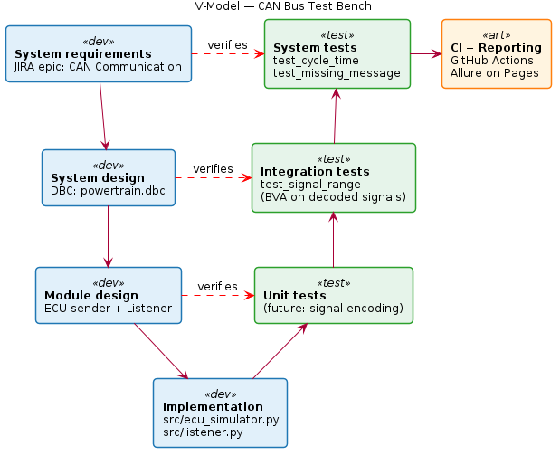
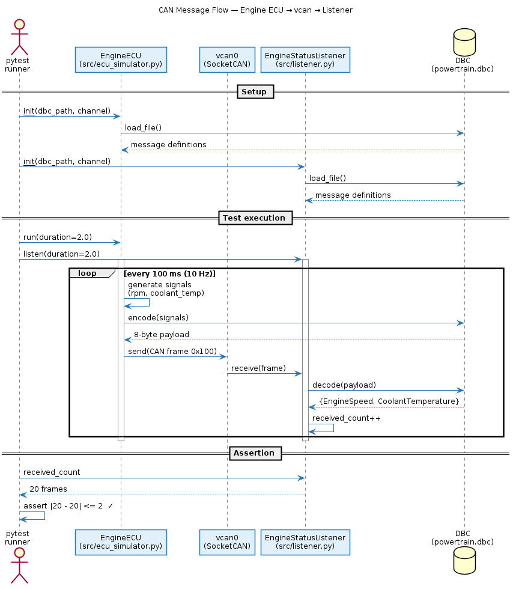

# Automotive CAN Bus Test Bench

[](https://github.com/AnAs21949/can-bus-test-bench/actions/workflows/ci.yml)
[](https://anas21949.github.io/can-bus-test-bench/)
[](https://www.python.org/)
[](LICENSE)

A virtual CAN bus test bench demonstrating the full V-cycle of automotive system testing — from requirements in JIRA, to encoded/decoded signals through a DBC file, to a pytest suite running on every push in GitHub Actions, with results published as an interactive Allure dashboard.

**Live test report:** [anas21949.github.io/can-bus-test-bench](https://anas21949.github.io/can-bus-test-bench/)

---

## Architecture

### V-Model — Requirements to Tests

The project mirrors the V-cycle expected in automotive system testing under ISO 26262 and Automotive SPICE. The left side (blue) walks down from requirements to implementation; the right side (green) walks up through unit, integration, and system tests. Red dashed lines show **bidirectional traceability** between each specification level and its matching test level.



### CAN Message Flow — Engine ECU → vcan → Listener

The DBC file (`powertrain.dbc`) acts as the encode/decode contract between the simulated Engine ECU and the listener. Both ends load the same DBC at setup. During execution, the ECU encodes signals (engine speed, coolant temperature) to an 8-byte payload, transmits at 10 Hz over `vcan0`, and the listener decodes them back into named signals — verified by pytest.



---

## ISTQB CTFL 4.0 — Applied in This Project

Every chapter of the ISTQB Foundation Level syllabus is anchored to a concrete artifact in this repository. The project isn't *inspired by* ISTQB — it *executes* it.

| ISTQB chapter | Concept | Where it lives in the repo |
|---|---|---|
| **Ch.1 — Fundamentals of testing** | Test objectives, 7 testing principles, verification vs. validation | This README + V-model diagram in `docs/diagrams/` |
| **Ch.2 — Testing throughout the SDLC** | V-model levels (unit / integration / system), test types | JIRA epics organized by test level + `tests/test_simulator.py` covers system level |
| **Ch.3 — Static testing** | Requirements quality, user-story criteria, reviews | JIRA user stories using `As / I want / So that` + acceptance criteria as `Given / When / Then` |
| **Ch.4 — Test analysis and design** | Black-box techniques: equivalence partitioning, boundary value analysis, error guessing | `test_signal_range` applies BVA on EngineSpeed [0..8000] and CoolantTemperature [-40..215]; `test_missing_message` is error guessing |
| **Ch.5 — Managing the test activities** | Defect lifecycle, risk-based testing, traceability | JIRA bug workflow with severity/priority + `docs/traceability.md` mapping stories → tests → defects |
| **Ch.6 — Test tools** | Test automation, CI, test reporting | `pytest` + GitHub Actions + Allure HTML report published to GitHub Pages |

---

## How to Run Locally

Tested on Ubuntu 22.04+ (including WSL2). The virtual CAN driver (`vcan`) is a Linux kernel module; macOS and Windows users need WSL2 or a VM.

### 1. Clone and set up the Python environment

```bash
git clone https://github.com/AnAs21949/can-bus-test-bench.git
cd can-bus-test-bench
python3 -m venv .venv
source .venv/bin/activate
pip install -r requirements.txt
```

### 2. Bring up the virtual CAN interface

```bash
sudo modprobe vcan
sudo ip link add dev vcan0 type vcan
sudo ip link set up vcan0
ip link show vcan0       # should show state UP
```

If `modprobe` fails on a cloud VM (e.g. GitHub Actions runner), install the extra kernel modules first:

```bash
sudo apt-get install -y linux-modules-extra-$(uname -r)
```

### 3. Run the test suite

```bash
pytest -v
```

You should see 3 tests pass: `test_cycle_time`, `test_signal_range`, `test_missing_message`.

### 4. Generate and view the Allure report

```bash
pytest --alluredir=allure-results
allure generate allure-results --clean -o allure-report
allure open allure-report
```

The CI version of this report is permanently hosted at [anas21949.github.io/can-bus-test-bench](https://anas21949.github.io/can-bus-test-bench/).

> **Allure CLI** is a Java tool. Install it via [the official guide](https://allurereport.org/docs/install/) or:
> ```bash
> curl -o allure.tgz -L https://github.com/allure-framework/allure2/releases/download/2.30.0/allure-2.30.0.tgz
> sudo tar -zxvf allure.tgz -C /opt/
> sudo ln -s /opt/allure-2.30.0/bin/allure /usr/local/bin/allure
> ```

---

## Project Structure

```
can-bus-test-bench/
├── .github/workflows/
│   └── ci.yml                          # GitHub Actions: pytest + Allure + Pages deploy
├── dbc/
│   └── powertrain.dbc                  # CAN message catalog (DBC format)
├── docs/
│   ├── diagrams/
│   │   ├── v-model.puml                # V-model source
│   │   ├── v-model.png                 # rendered
│   │   ├── sequence-can-flow.puml      # CAN message flow source
│   │   └── sequence-can-flow.png       # rendered
│   └── traceability.md                 # JIRA story → pytest → defect matrix
├── src/
│   ├── ecu_simulator.py                # Engine ECU sender (10 Hz periodic)
│   └── listener.py                     # CAN frame receiver + DBC decoder
├── tests/
│   └── test_simulator.py               # pytest suite with Allure markers
├── requirements.txt
├── README.md
└── LICENSE
```

## Tool Stack

| Tool | Role |
|---|---|
| **Python 3.11** | Implementation language |
| **python-can** | SocketCAN abstraction — send/receive CAN frames |
| **cantools** | DBC parser — encode/decode signals from CAN payloads |
| **SocketCAN (vcan)** | Linux kernel virtual CAN interface — no real hardware needed |
| **pytest** | Test framework |
| **JIRA + Xray** | Requirements engineering, user stories, defect tracking |
| **GitHub Actions** | CI/CD — runs the suite on every push |
| **Allure** | HTML test reporting, published to GitHub Pages |
| **PlantUML** | Diagrams-as-code for V-model and sequence diagrams |

## About

Built by [Anas](https://github.com/AnAs21949) — ISTQB CTFL 4.0 certified, ENSA Berrechid (Aeronautics & Embedded Systems). This project is a portfolio piece targeting QA / Test Engineer roles in Morocco's automotive nearshore sector (ALTEN, Capgemini, Expleo, Akkodis, Inetum).

## License

[MIT](LICENSE)
